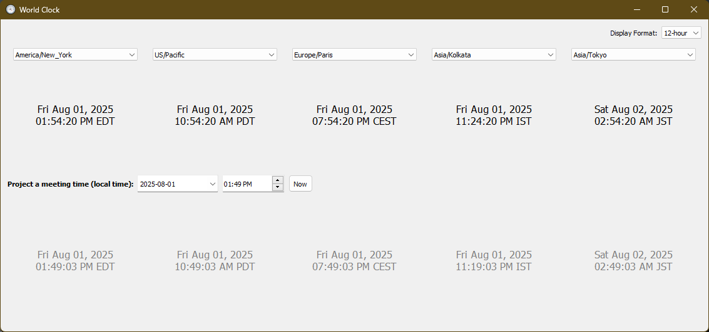

# World Clock App

A simple world clock desktop app built with Python and PyQt5 to help avoid time zone confusion when scheduling meetings.

## ✨ Features

- Displays current time in 5 time zones
- Auto-detects your system time zone and shows it on the left
- Dropdowns let you change each displayed time zone
- Enter a future date/time to project that moment across all selected time zones
- "Now" button quickly resets the projection to the current time
- Optional 12-hour / 24-hour format toggle
- Time zone layout adjusts automatically when traveling

## 🖥️ Screenshot



## 🚀 Running the App

### Option 1: Run from Source

```bash
pip install -r requirements.txt
python main.py
